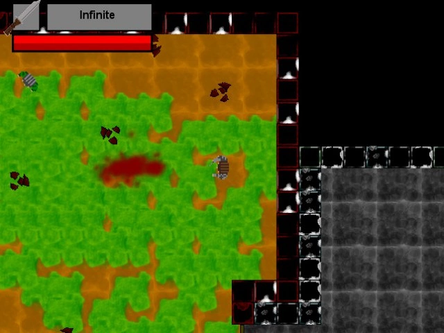
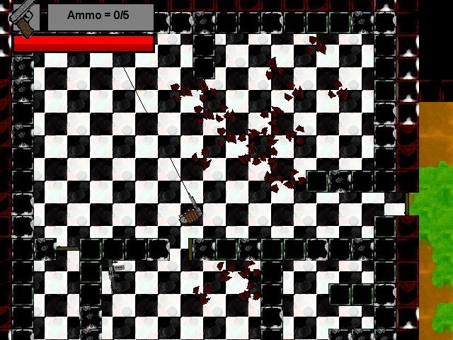
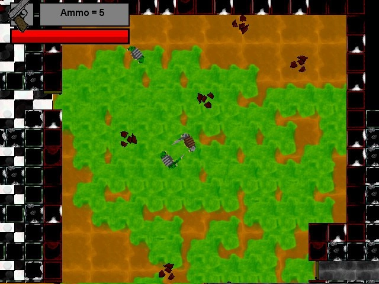
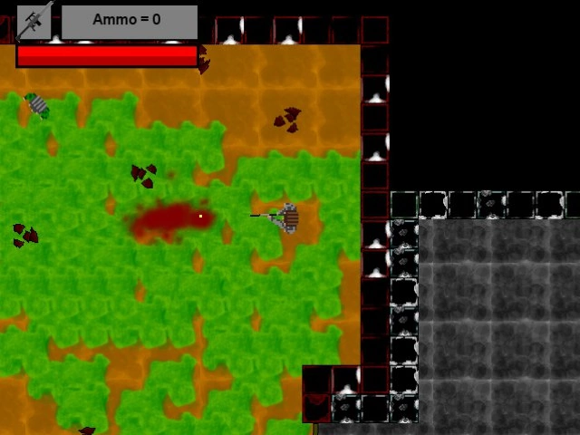
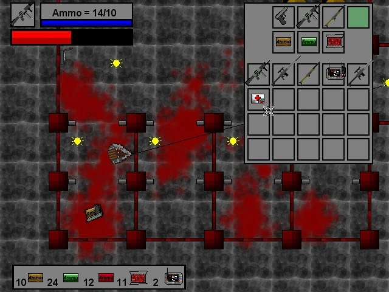

# Repeater (aka Darkening)

This work is licensed under a <a rel="license" href="http://creativecommons.org/licenses/by-nc-nd/4.0/">Creative Commons Attribution-NonCommercial-NoDerivatives 4.0 International License (CC-BY-NC-ND)</a>.
________________

**Engine - Game Maker 8.1**

**Language - Game Maker Language**

**Source Code - Available: Latest version (As GM:S1 project)**

**Executables - Multiple old versions**

**Development Date - 2015 to 2016**

________________

## Description
This project was what is usually called a "dream game", at least it was at the time. The plot was supposed to be surrounding the dying unverse and player's attempts to stay alive. A top down shooter with interstellar travel... No wonder I wasn't able to finish it.

## Screenshots
 
 

